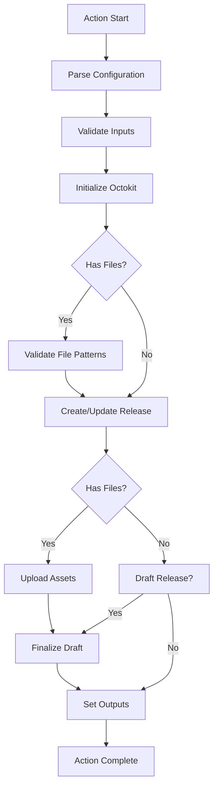

# Architecture - Workflow Flow

## Overview

This document describes the step-by-step execution flow of the `actions-gh-release` action. Understanding this flow is essential for debugging, extending, or troubleshooting the action.

## High-Level Sequence

## Detailed Step-by-Step Flow

### 1. Configuration Parsing (`src/index.ts:11`)

**Source**: `parseConfig(env)`
**Purpose**: Convert environment variables to typed configuration
**Process**:

- Reads `INPUT_*` environment variables set by GitHub Actions
- Parses boolean strings (`"true"`/`"false"`) to actual booleans
- Normalizes tag names (strips `refs/tags/` prefix)
- Sets default values for optional inputs

### 2. Input Validation (`src/index.ts:12-27`)

**Purpose**: Ensure preconditions are met before API calls
**Checks**:

- **Tag Requirement**: Unless creating a draft, requires either:
  - `input_tag_name` is set, OR
  - `github.ref_type == 'tag'`
- **File Pattern Validation**: If `files` input provided:
  - Expands glob patterns in `working_directory`
  - Checks for unmatched patterns
  - Warns or fails based on `fail_on_unmatched_files`

### 3. GitHub Client Initialization (`src/index.ts:34-50`)

**Source**: `getOctokit(config.github_token, {...})`
**Features**:

- Built-in throttling plugin for rate limit handling
- Retry plugin for transient errors
- Custom logging for quota/abuse warnings

### 4. Release Creation/Update (`src/github.ts:500-615`)

**Function**: `release(config)`
**Process**:

#### Finding Existing Release

1. Lists releases for the repository (paginated)
2. Searches for release with matching tag name
3. If found: returns existing release with `created: false`

#### Creating New Release

1. Builds release parameters from config
2. Sets `generate_release_notes` if requested
3. **Race Condition Handling**:
   - Tries to create release
   - If 422 "already_exists" error: finds the duplicate
   - Retries up to 3 times with exponential backoff
4. Returns new release with `created: true`

### 5. Asset Upload (`src/github.ts:306-498`)

**Function**: `upload(release, config)`
**Process**:

#### File Preparation

1. Parse `files` input with brace-aware splitting
2. Expand glob patterns in `working_directory`
3. Filter out duplicates and sort paths

#### Upload Strategy

- **Default**: Parallel uploads (`Promise.all`)
- **Ordered**: Sequential if `preserve_order: true`

#### Upload Loop (per file)

1. **Check Existing**: List current assets in release
2. **Delete if Exists**: If `overwrite_files: true`, delete matching asset
3. **Upload**: Stream file to GitHub's upload URL
4. **Error Recovery**:
   - 404 on update: asset was deleted concurrently, retry upload
   - 422 on upload: handle immutable release repositories
   - Network errors: retry with exponential backoff

### 6. Draft Finalization (`src/github.ts:626-684`)

**Function**: `finalizeRelease(release, config)`
**Conditions**:

- Only runs if `draft: true` AND release is currently a draft
- **Exception**: Immutable release repositories keep as draft

**Process**:

1. Update release with `draft: false`
2. Handle repository rule violations (403 errors)
3. Retry on transient failures

### 7. Output Setting (`src/index.ts:90-102`)

**Outputs Set**:

- `url`: HTML URL to the release
- `id`: Numeric release ID
- `upload_url`: API URL for uploading more assets
- `assets`: JSON array of uploaded asset metadata

### 8. Error Handling Flow

**Throughout Execution**:

1. **Try/Catch Blocks**: Each major phase wrapped
2. **setFailed()**: Calls GitHub Actions error reporting
3. **Console Output**: Detailed logs for debugging
4. **Exit Codes**: Proper process termination

## Concurrency Considerations

### Race Conditions

The action handles several race conditions:

1. **Duplicate Release Creation**: Multiple workflows creating same release
2. **Concurrent Asset Updates**: Multiple workflows modifying same release
3. **Asset Deletion During Upload**: Asset deleted between list and upload

### Solutions

1. **Find-Then-Create**: Always check for existing releases first
2. **Retry with Backoff**: Exponential backoff for 422 errors
3. **Asset Reconciliation**: Re-upload if asset disappears during process

## Performance Characteristics

### Fast Path (No Files)

1. Parse config: ~1ms
2. Create release: ~500ms (API call)
3. Total: ~600ms

### Typical Path (With Files)

1. Parse config: ~1ms
2. Validate files: ~10-100ms (depends on filesystem)
3. Create release: ~500ms
4. Upload assets: ~100ms per MB (network dependent)
5. Total: Variable based on asset size/count

### Memory Usage

- **Configuration**: Minimal (small object)
- **File Buffering**: Stream-based uploads (low memory)
- **API Responses**: Capped pagination (prevents large responses)

## Key Decision Points

### 1. When to Fail vs. Warn

- **Fail**: Missing tag (non-draft), permission errors
- **Warn**: Unmatched file patterns (unless `fail_on_unmatched_files: true`)

### 2. When to Retry

- **Retry**: Rate limiting (429), network errors, 422 duplicate errors
- **No Retry**: Validation errors, permission errors, invalid tokens

### 3. Parallel vs. Sequential Uploads

- **Parallel**: Default for performance
- **Sequential**: When `preserve_order: true` or debugging needed

## Monitoring Points

### Console Output

- `🤔 Pattern 'X' does not match any files.` - Warning
- `⚠️ GitHub Releases requires a tag` - Error
- `Request quota exhausted` - Rate limit warning
- `Retrying after X seconds!` - Retry attempt

### Exit Codes

- `0`: Success
- `1`: Error (via `setFailed()`)

## Related Documentation

- [Core Concepts](core-concepts.md) - Architecture overview
- [Error Handling](error-handling.md) - Detailed error recovery strategies
- [GitHub API Integration](../integration/github-api.md) - API usage patterns
